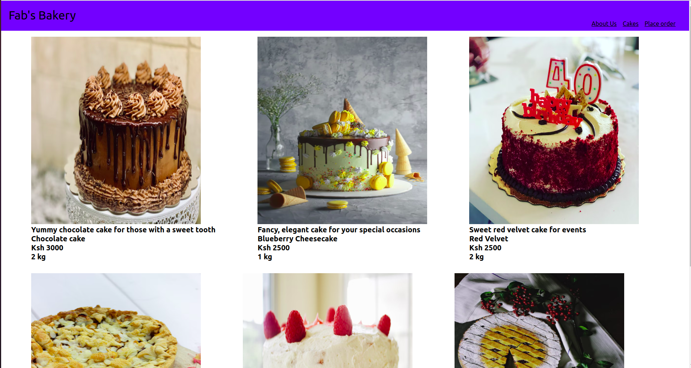
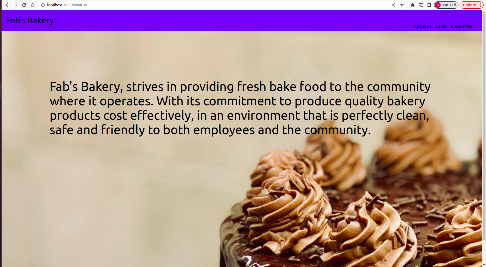

# Fab's Delicacies Bakery

      Fab's Bakery, strives in providing fresh bake food to the community
      where it operates. With its commitment to produce quality bakery
      products cost effectively, in an environment that is perfectly clean,
      safe and friendly to both employees and the community.

Technologies used: *HTML *CSS *JS *React

Setup/Installation Requirements Open your terminal in pc and create a folder. Clone this repository into the folder using the command line below, $git clone "https://github.com/Sharonah8/Fab-Delicacies-Bakery" open it on an editor (Atom,vscode,vim,sublime Text, etc.) contribute and push your changes to your repository

Link to site https://sharonah8.github.io/RecipeApp/

Support and contact details For enquiries and contribution to our project, kindly reach out through E-mail: "nyamongosharon88@gmail.com"

License MIT Licence. Copyright (c) {2021} LICENSE © Sharon Nyamongo
